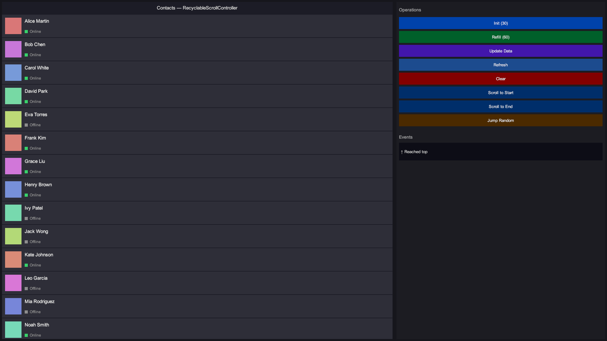
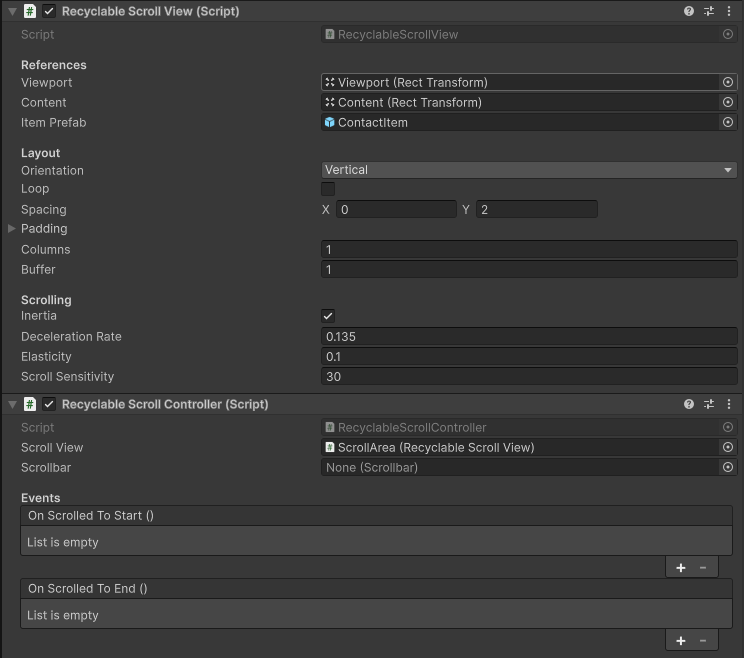
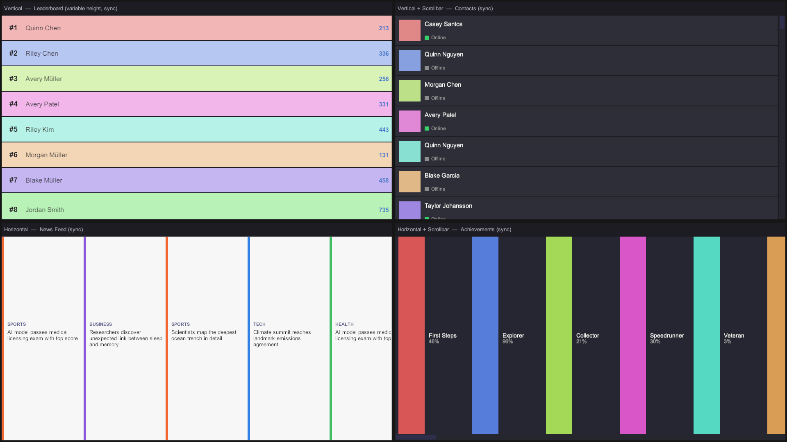
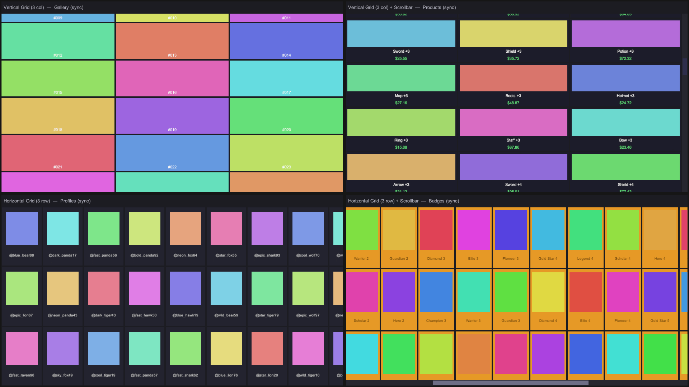

# KidzDev Unity Recyclable Scroll

High-performance recyclable scroll view for Unity uGUI. Displays arbitrarily long lists and grids
by recycling a small pool of item views — only a viewport-worth of GameObjects (plus `buffer`) ever
exist, regardless of data-set size. Drives its own scroll engine (drag, inertia, mouse-wheel,
elastic edges) without delegating to a `ScrollRect`.



## Install

Add via Package Manager → *Add package from git URL*, or edit `Packages/manifest.json`:

```
https://github.com/knabsiraphop/kidzdev-unity-recyclable-scroll.git#v0.4.1
```

**Dependencies**: `com.unity.ugui` 2.0.0 and [UniTask](https://openupm.com/packages/com.cysharp.unitask/) via OpenUPM.

---

## Features

- **Owned scroll engine** — `RecyclableScrollView` drives drag, inertia, mouse-wheel, and
  elastic-edge overscroll itself via pointer event interfaces. No `ScrollRect` required.
- **Linear and grid layouts** — single-column/row lists or K-column grids; set `columns` in the
  inspector.
- **Vertical and horizontal orientations.**
- **Variable item sizes** — each item can report its own main-axis size via
  `IRecyclableDataSource.GetItemSize`.
- **Loop mode** — infinite wrap-around scrolling via virtual-index arithmetic; no content
  duplication.
- **Async binding** — implement `IAsyncRecyclableDataSource` to bind items across frame
  boundaries (e.g. load a texture or sprite); in-flight binds are cancelled automatically when
  an item scrolls out of view.
- **Custom instantiation seam** — `IItemInstantiator` replaces the default `Instantiate(prefab)`
  call with any async strategy: Addressables, `Resources.LoadAsync`, a custom object pool, etc.
- **High-level controller** — `RecyclableScrollController` exposes named operations, edge-detection
  `UnityEvent`s, and optional uGUI `Scrollbar` sync.
- **Windowed content rect** — content stays viewport-sized; item coordinates stay small regardless
  of list length.

---

## Inspector setup



### 1. Create the scroll hierarchy

```
Canvas
└── ScrollRoot                   ← add RecyclableScrollView here
    ├── Viewport  (RectTransform, Mask component, Image raycast target)
    │   └── Content  (RectTransform — stays viewport-sized; managed by the view)
    └── Scrollbar (optional, for RecyclableScrollController)
```

The `Viewport` `Image` (or any raycast-target `Graphic`) must cover the visible area so the
component can receive drag and mouse-wheel pointer events.

### 2. Wire RecyclableScrollView

Assign in the Inspector:

| Field | What to assign |
|---|---|
| `viewport` | The `RectTransform` of your Viewport object |
| `content` | The `RectTransform` of the Content child inside Viewport |
| `itemPrefab` | A prefab whose root has a component derived from `RecyclableScrollItem` |

### 3. Choose layout settings

| Field | Default | Notes |
|---|---|---|
| `orientation` | Vertical | Scroll direction |
| `columns` | 1 | 1 = linear list, >1 = grid |
| `loop` | false | Infinite wrap-around |
| `spacing` | (0, 0) | X = horizontal gap, Y = vertical gap |
| `padding` | 0 all | Inner edge padding in pixels |
| `buffer` | 1 | Extra items kept alive off each edge of the viewport |

### 4. Choose scroll settings

| Field | Default | Notes |
|---|---|---|
| `inertia` | true | Momentum after a flick |
| `decelerationRate` | 0.135 | Velocity falloff per second (same as uGUI default) |
| `elasticity` | 0.1 | Rubber-band stiffness at edges; 0 = hard stop |
| `scrollSensitivity` | 30 | Pixels per mouse-wheel notch |

### 5. (Optional) Add RecyclableScrollController

Add `RecyclableScrollController` to the same GameObject as (or referencing) the
`RecyclableScrollView`. Optionally wire:
- `scrollbar` — a uGUI `Scrollbar` the controller keeps synchronized.
- `onScrolledToStart` / `onScrolledToEnd` — `UnityEvent`s fired when the scroll reaches an edge.

---

## Use cases

### 1. Simple list — uniform item size

The most common scenario: all items are the same height, data bound synchronously.

```csharp
public class ShopItem : RecyclableScrollItem
{
    [SerializeField] private TMP_Text nameLabel;
    [SerializeField] private TMP_Text priceLabel;

    public void SetData(ShopEntry entry)
    {
        nameLabel.text  = entry.Name;
        priceLabel.text = $"${entry.Price}";
    }
}
```

```csharp
// Assign once, or replace when the data changes.
var source = new RecyclableDataSource<ShopItem>(
    count:    catalog.Count,
    itemSize: 80f,                                  // fixed height for every item
    bind:     (view, index) => view.SetData(catalog[index])
);
scrollView.SetDataSource(source);
```

`SetDataSource` resets the scroll to the top and rebuilds immediately.

---

### 2. Variable item sizes

Return a different size per index from `GetItemSize`.

```csharp
var source = new RecyclableDataSource<MessageBubble>(
    count:   messages.Count,
    getSize: index => messages[index].EstimatedHeight(),   // Func<int, float>
    bind:    (view, index) => view.SetMessage(messages[index])
);
scrollView.SetDataSource(source);
```

Offsets are precomputed as prefix sums; visible-index lookup is O(log n).

---

### 3. Async bind (e.g. load a sprite per item)

Use `AsyncRecyclableDataSource<TItem>` when the bind work spans frame boundaries. The
`CancellationToken` is cancelled automatically if the item scrolls out before binding finishes.

```csharp
var source = new AsyncRecyclableDataSource<GalleryCard>(
    count:    gallery.Count,
    itemSize: 200f,
    bind:     async (card, index, ct) =>
    {
        Texture2D tex = await TextureLoader.LoadAsync(gallery[index].Url, ct);
        card.SetThumbnail(tex);
    }
);
scrollView.SetDataSource(source);
```

The synchronous `BindItem` (from `IRecyclableDataSource`) is a no-op on `AsyncRecyclableDataSource`
and does not need to be implemented.

---

### 4. Async bind via Addressables

```csharp
var source = new AsyncRecyclableDataSource<ProductCard>(
    count:    products.Count,
    itemSize: 120f,
    bind: async (card, index, ct) =>
    {
        var sprite = await Addressables
            .LoadAssetAsync<Sprite>(products[index].IconKey)
            .WithCancellation(ct);
        card.SetIcon(sprite);
        card.SetName(products[index].Name);
    }
);
scrollView.SetDataSource(source);
```

---

### 5. Custom item instantiation via Addressables

By default `RecyclableScrollView` instantiates items via `Object.Instantiate(itemPrefab)`.
Supply an `instantiate` delegate (and a matching `destroy`) to use Addressables instead — the view
detects the `IItemInstantiator` automatically.

```csharp
var prefabRef = new AssetReferenceGameObject("your-guid");

var source = new RecyclableDataSource<MyItemView>(
    count:    items.Count,
    itemSize: 80f,
    bind:     (view, index) => view.SetData(items[index]),
    instantiate: ct => Addressables
        .InstantiateAsync(prefabRef)
        .WithCancellation(ct)
        .ContinueWith(go => go.GetComponent<MyItemView>()),
    destroy:  go => Addressables.ReleaseInstance(go)
);
scrollView.SetDataSource(source);
```

The `IItemInstantiator` is checked before the pool: pooled items (already instantiated) are reused
first; `InstantiateAsync` is only called when the pool is empty.

---

### 6. Multi-column grid

Set `columns > 1` in the inspector (or at runtime before calling `SetDataSource`). Each row's
main-axis size is the maximum `GetItemSize` in that row; cells share the viewport's cross extent
(minus cross padding) evenly, separated by the cross component of `spacing`.

```
Inspector:
  columns   = 3
  spacing   = (8, 8)   // 8 px between columns, 8 px between rows
  padding   = (16, 16, 16, 16)
```

```csharp
var source = new RecyclableDataSource<GalleryCard>(
    count:    photos.Count,
    itemSize: 160f,                // height of every row (or use getSize for variable rows)
    bind:     (card, index) => card.SetPhoto(photos[index])
);
scrollView.SetDataSource(source);
```

A grid can also use async binding — use `AsyncRecyclableDataSource<T>` exactly as in scenario 3.

---

### 7. Loop mode (infinite scroll)

Enable `loop` in the inspector. The view wraps any scroll offset back into `[0, TotalContentLength)`
using virtual-index arithmetic, so scrolling past the end seamlessly continues from the start.

```csharp
// Works with any data source — uniform, variable, async.
var source = new RecyclableDataSource<BannerSlide>(
    count:    banners.Count,
    itemSize: 480f,
    bind:     (slide, index) => slide.SetBanner(banners[index])
);
scrollView.SetDataSource(source);
// Optionally, start mid-list:
scrollView.ScrollToOffset(scrollView.TotalContentLength * 2f); // start a few laps in
```

`ScrollToIndex` and `ScrollToOffset` operate in physical space (one copy of the list).

---

### 8. Runtime refresh

Call `Refresh()` when the data values change in-place without affecting item count or sizes:

```csharp
// The data has updated but count and sizes are unchanged.
// Re-bind all visible items without resetting scroll position.
scrollView.Refresh();
```

`Refresh()` has a re-entrancy guard (added in v0.4.1): if a sizer's `OnSizeChanged` fires during
the internal `Canvas.ForceUpdateCanvases()`, the nested call returns immediately, preventing
duplicate item sets.

To replace the data entirely and reset scroll to the top, call `SetDataSource` again.

---

### 9. Implementing IRecyclableDataSource directly

Use this when the delegate helpers don't fit your architecture:

```csharp
public class LeaderboardDataSource : IRecyclableDataSource
{
    private List<LeaderboardEntry> _entries;

    public LeaderboardDataSource(List<LeaderboardEntry> entries) => _entries = entries;

    public int   ItemCount          => _entries.Count;
    public float GetItemSize(int i) => i == 0 ? 72f : 56f;   // first item taller (gold)
    public void  BindItem(int index, GameObject item)
        => item.GetComponent<LeaderboardRow>().SetEntry(_entries[index]);
}

scrollView.SetDataSource(new LeaderboardDataSource(entries));
```

---

### 10. Implementing IAsyncRecyclableDataSource directly

```csharp
public class NewsDataSource : IAsyncRecyclableDataSource
{
    private List<NewsItem> _items;

    public NewsDataSource(List<NewsItem> items) => _items = items;

    public int   ItemCount          => _items.Count;
    public float GetItemSize(int i) => 180f;
    public void  BindItem(int index, GameObject item) { }  // unused — async path takes over

    public async UniTask BindItemAsync(int index, GameObject item, CancellationToken ct)
    {
        var card = item.GetComponent<NewsCard>();
        card.SetHeadline(_items[index].Headline);
        Sprite hero = await _items[index].LoadHeroAsync(ct);
        card.SetHero(hero);
    }
}
```

---

### 11. Using RecyclableScrollController

`RecyclableScrollController` is a high-level bridge that adds named operations, edge-detection
events, and `Scrollbar` sync on top of the view.

```csharp
public class FeedController : MonoBehaviour
{
    [SerializeField] private RecyclableScrollController controller;

    private List<Post> _posts = new List<Post>();
    private int _page;

    private void Start()
    {
        controller.OnScrolledToEnd.AddListener(LoadNextPage);
        LoadFirstPage();
    }

    private async void LoadFirstPage()
    {
        _posts = await FeedApi.GetPage(0);
        controller.Init(BuildSource());
    }

    private async void LoadNextPage()
    {
        _page++;
        var newPosts = await FeedApi.GetPage(_page);
        _posts.AddRange(newPosts);
        controller.UpdateData(BuildSource());  // scroll position preserved
    }

    private IRecyclableDataSource BuildSource()
        => new RecyclableDataSource<PostCard>(
               count:    _posts.Count,
               itemSize: 200f,
               bind:     (card, i) => card.SetPost(_posts[i]));
}
```

#### Controller method reference

| Method | Description |
|---|---|
| `Init(source)` | Assign data source for the first time; reset scroll to top |
| `Refill(source)` | Replace data set; reset scroll to top |
| `UpdateData(source)` | Replace data set; preserve current scroll position |
| `Refresh()` | Re-bind visible items without changing scroll position |
| `Clear()` | Empty the list |
| `ScrollToStart()` | Jump to leading edge |
| `ScrollToEnd()` | Jump to trailing edge |
| `JumpToIndex(index)` | Align viewport start to a specific item |

---

### 12. Integration with ResponsiveSizeCalculator (responsive-fit)

When the viewport is resized at runtime (e.g. responsive UI, orientation change), the item sizes
returned by `GetItemSize` may change. Hook into `ResponsiveSizeCalculator.OnSizeChanged` to
trigger a rebuild:

```csharp
public class ResponsiveList : MonoBehaviour
{
    [SerializeField] private RecyclableScrollView scrollView;
    [SerializeField] private ResponsiveSizeCalculator sizer;

    private IRecyclableDataSource _source;

    private void OnEnable()
        => sizer.OnSizeChanged.AddListener(OnSizeChanged);

    private void OnDisable()
        => sizer.OnSizeChanged.RemoveListener(OnSizeChanged);

    public void SetData(List<MyItem> items)
    {
        _source = new RecyclableDataSource<MyItemView>(
            count:    items.Count,
            getSize:  _ => sizer.CurrentSize.y,   // re-queried at each rebuild
            bind:     (view, i) => view.SetData(items[i])
        );
        scrollView.SetDataSource(_source);
    }

    private void OnSizeChanged()
    {
        // Refresh() re-runs Rebuild with the updated viewport metrics.
        // The _refreshing guard in v0.4.1 prevents a re-entrant call from
        // OnSizeChanged firing again during Canvas.ForceUpdateCanvases inside Refresh.
        scrollView.Refresh();
    }
}
```

---

## Full API reference

### RecyclableScrollView

```csharp
// Inspector-assigned references (required)
[SerializeField] RectTransform viewport;
[SerializeField] RectTransform content;
[SerializeField] GameObject    itemPrefab;

// Read-only properties
float TotalContentLength { get; }   // full virtual main-axis length of the data set
float ScrollPosition     { get; }   // current scroll offset from the leading edge
float MaxScrollPosition  { get; }   // max valid offset (TotalContentLength − viewport size)
bool  IsAtStart          { get; }   // true when ScrollPosition ≤ 0
bool  IsAtEnd            { get; }   // true when ScrollPosition ≥ MaxScrollPosition (within 0.5 px)

// Data source
void SetDataSource(IRecyclableDataSource source);
    // auto-detects IItemInstantiator on source, resets scroll to top, rebuilds
void SetDataSource(IRecyclableDataSource source, IItemInstantiator instantiator);
    // explicit instantiator takes precedence over auto-detection
void SetInstantiator(IItemInstantiator instantiator);
    // change the instantiator without replacing the data source; null = revert to Instantiate(prefab)

// Scroll control
void Refresh();                         // rebuild the visible window from current data source
void ScrollToIndex(int index);          // align item at index to the viewport leading edge
void ScrollToOffset(float mainOffset);  // jump to absolute main-axis offset
```

### RecyclableScrollItem

```csharp
// Derive from this for your item prefab root component
public class RecyclableScrollItem : MonoBehaviour
{
    public int Index { get; }           // data index this view currently represents
    protected virtual void OnBind() {}  // called after Index is set and data is bound
}
```

`Index` and `OnBind` are available for post-bind logic, but most data-binding belongs in the
`bind` delegate (or `BindItem` / `BindItemAsync`) rather than `OnBind`.

### IRecyclableDataSource

```csharp
public interface IRecyclableDataSource
{
    int   ItemCount { get; }                       // total number of items
    void  BindItem(int index, GameObject item);    // push data at index into the recycled view
    float GetItemSize(int index);                  // main-axis size (height vertical, width horizontal)
}
```

### IAsyncRecyclableDataSource : IRecyclableDataSource

```csharp
public interface IAsyncRecyclableDataSource : IRecyclableDataSource
{
    UniTask BindItemAsync(int index, GameObject item, CancellationToken cancellationToken);
    // BindItem (sync) may be a no-op — the async path replaces it entirely.
}
```

### RecyclableDataSource\<TItem\>

```csharp
// Synchronous convenience helper — no subclassing required.
// TItem is the Component on the item prefab that receives the bind action.
new RecyclableDataSource<TItem>(
    count:       int,
    getSize:     Func<int, float>,
    bind:        Action<TItem, int>,
    instantiate: Func<CancellationToken, UniTask<TItem>> = null,  // enables IItemInstantiator
    destroy:     Action<GameObject> = null);                       // defaults to Object.Destroy

// Uniform-size overload
new RecyclableDataSource<TItem>(
    count:       int,
    itemSize:    float,
    bind:        Action<TItem, int>,
    instantiate: Func<CancellationToken, UniTask<TItem>> = null,
    destroy:     Action<GameObject> = null);
```

### AsyncRecyclableDataSource\<TItem\>

```csharp
// Async bind — spans frame boundaries; cancellation handled automatically.
new AsyncRecyclableDataSource<TItem>(
    count:       int,
    getSize:     Func<int, float>,
    bind:        Func<TItem, int, CancellationToken, UniTask>,
    instantiate: Func<CancellationToken, UniTask<TItem>> = null,
    destroy:     Action<GameObject> = null);

// Uniform-size overload
new AsyncRecyclableDataSource<TItem>(
    count:       int,
    itemSize:    float,
    bind:        Func<TItem, int, CancellationToken, UniTask>,
    instantiate: Func<CancellationToken, UniTask<TItem>> = null,
    destroy:     Action<GameObject> = null);
```

### IItemInstantiator

```csharp
public interface IItemInstantiator
{
    bool IsEnabled { get; }
    // false = fall back to Instantiate(prefab). Always true for standalone implementations;
    // the generic helpers tie it to whether an 'instantiate' delegate was supplied.

    UniTask<GameObject> InstantiateAsync(CancellationToken ct);
    // produce a new item GameObject; do NOT parent it — the view handles that.

    void Destroy(GameObject item);
    // release the item; use Addressables.ReleaseInstance when loading via Addressables.
}
```

### RecyclableScrollController

```csharp
// Inspector-assigned (optional)
[SerializeField] RecyclableScrollView scrollView;  // auto-resolved from same GameObject if blank
[SerializeField] Scrollbar scrollbar;              // kept in sync with scroll position

// State
bool IsInitialized { get; }  // true after Init/Refill/UpdateData/Clear

// Operations
void Init(IRecyclableDataSource source);        // first assignment; reset to top
void Refill(IRecyclableDataSource source);      // replace data; reset to top
void UpdateData(IRecyclableDataSource source);  // replace data; preserve scroll position
void Refresh();                                 // re-bind visible items; preserve scroll position
void Clear();                                   // empty the scroll view
void ScrollToStart();
void ScrollToEnd();
void JumpToIndex(int index);

// Events
UnityEvent OnScrolledToStart { get; }  // fires once when leading edge is reached
UnityEvent OnScrolledToEnd   { get; }  // fires once when trailing edge is reached
```

---

## Scenario decision guide

| What you need | Use |
|---|---|
| Simple list, sync bind, fixed height | `RecyclableDataSource<T>` with `itemSize` overload |
| Simple list, sync bind, variable heights | `RecyclableDataSource<T>` with `getSize` delegate |
| Async bind (load textures, remote data) | `AsyncRecyclableDataSource<T>` |
| Load prefab from Addressables | Add `instantiate`/`destroy` delegates to either data source |
| Multi-column grid | Set `columns > 1` in the inspector; use either data source |
| Infinite / carousel scroll | Enable `loop` in the inspector |
| Pagination / load-more | Use `RecyclableScrollController.OnScrolledToEnd` + `UpdateData` |
| Reactive to viewport resize | Call `Refresh()` in `ResponsiveSizeCalculator.OnSizeChanged` |
| Full control over data logic | Implement `IRecyclableDataSource` (+ optionally `IAsyncRecyclableDataSource`) directly |

---

## Sample

Import the **Demo** sample from the Package Manager. It contains three scenes:

- `01_ControllerShowcase` — demonstrates `RecyclableScrollController` operations and events.


- `02_LinearScrolls` — vertical and horizontal linear lists with a variety of item types.



- `03_GridScrolls` — multi-column grids with uniform and variable row heights.



---

## License

MIT — see [LICENSE.md](LICENSE.md).
